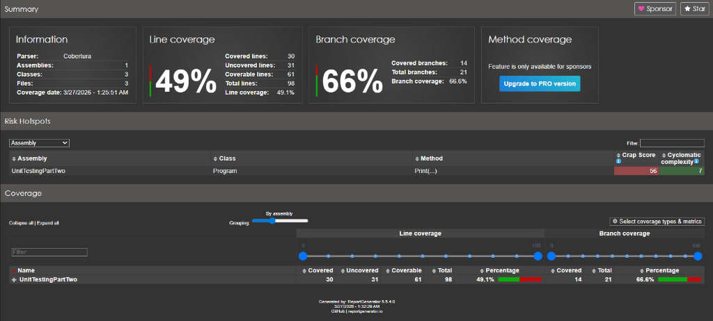

# Unit Testing & Clean Code Mastery

This repository is an educational resource focused on **Unit Testing**, **Clean Code**, and **SOLID Principles** within the .NET ecosystem. It demonstrates how to build testable systems and verify them using professional tools.

---

## Core Learning: Payroll System

The Payroll system is the primary vehicle for demonstrating unit testing techniques. It calculates complex salary slips based on business rules that are extensively verified.

### 🧪 Testing Strategy: xUnit + Moq

We use **xUnit** as our testing framework and **Moq** for dependency isolation. Our testing strategy follows these core pillars:

#### 1. The AAA Pattern (Arrange, Act, Assert)
Every test is structured for maximum clarity and professionalism. Here is a real-world example from our suite:

```csharp
[Fact]
public void CalculateTax_WhenBasicSalaryExceedsLowThreshold_ShouldReturnTaxAmount()
{
    // Arrange
    var mockZone = new Mock<IZoneService>();
    var processor = new SalarySlipProcessor(mockZone.Object);
    
    // Wage (600) * Days (20) = $12,000 (Exceeds $10,000 threshold)
    var employee = new Employee { Wage = 600m, WorkingDays = 20 };

    // Act
    var actualTax = processor.CalculateTax(employee);

    // Assert
    // Using xUnit's Assert to verify the 2% tax rate for medium salaries
    var expectedTax = 12000m * 0.02m; 
    Assert.Equal(expectedTax, actualTax);
}
```

#### 2. Dependency Isolation (Mocking)
The `SalarySlipProcessor` depends on `IZoneService` to determine if a location is a "Danger Zone". To test the processor in isolation without real external data:
- We create a `Mock<IZoneService>`.
- We **Setup** expected behaviors (e.g., returning `true` for "Ukraine").
- This ensures our tests are fast, deterministic, and focus only on the Payroll logic.

#### 3. Edge Case Coverage
Our test suite doesn't just check the happy path. It specifically targets:
- **Null Guards**: Ensuring `ArgumentNullException` is thrown when inputs are missing.
- **Boundary Conditions**: Testing salary thresholds (e.g., exactly $10,000 or $20,000) to ensure tax brackets are applied correctly.
- **Capped Values**: Verifying that dependency allowances do not exceed the $2,000 maximum regardless of the number of children.

### 📊 Understanding Code Coverage
We use coverage reports to identify untested logic. Below is our latest report:



*   **Green Areas**: Fully covered by tests.
*   **Red Areas**: Logic that needs more test scenarios.
*   **Goal**: Ensure our "Risk Hotspots" (complex methods like `CalculateTax`) have 100% coverage.

---

## Application: Issue Tracking System

The second project (`UnitTestingPartTwo`) demonstrates logic that is "Built for Testing":
- **Deterministic Key Generation**: Logic that can be easily verified with unit tests.
- **Custom Exceptions**: Specialized error handling that defines clear failure states for testing.
- **Console Visualization**: A practical example of separating core logic from the user interface.

## Getting Started

### Prerequisites
- .NET 8.0 SDK
- Visual Studio 2022 / VS Code

### Run the Projects
```bash
# Build the whole solution
dotnet build

# Run the Issue Tracker
dotnet run --project Testing_02/UnitTestingPartTwo
```

### Run the Tests (The Most Important Part!)
Execute this command to see the 50+ tests in action:
```bash
dotnet test
```

---
*Developed as a practical guide to writing robust, testable .NET code.*

---
*Created as part of a Unit Testing and Clean Architecture learning path.*
